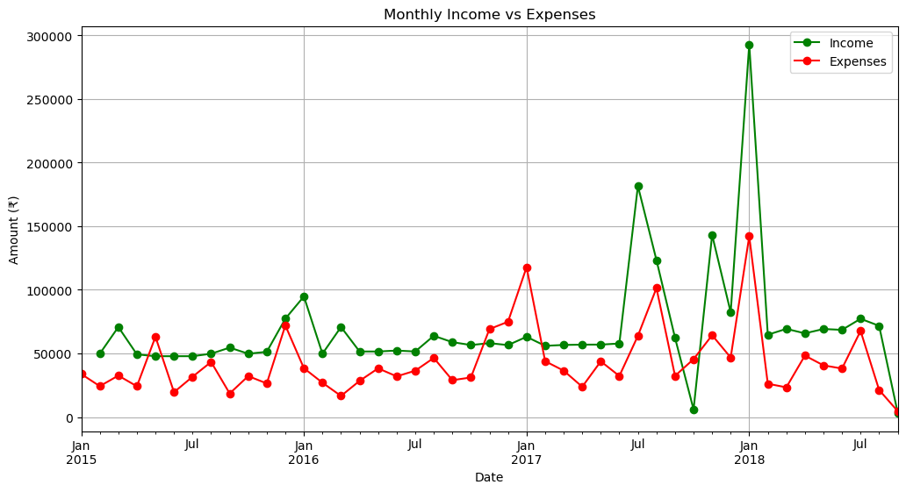
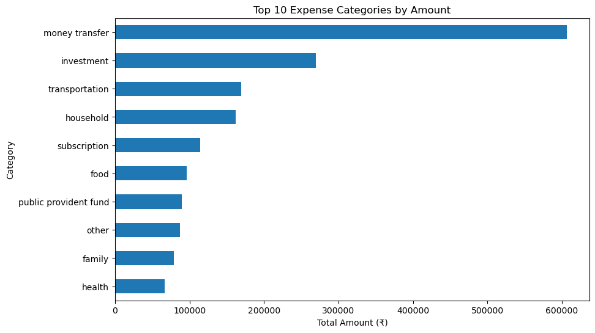
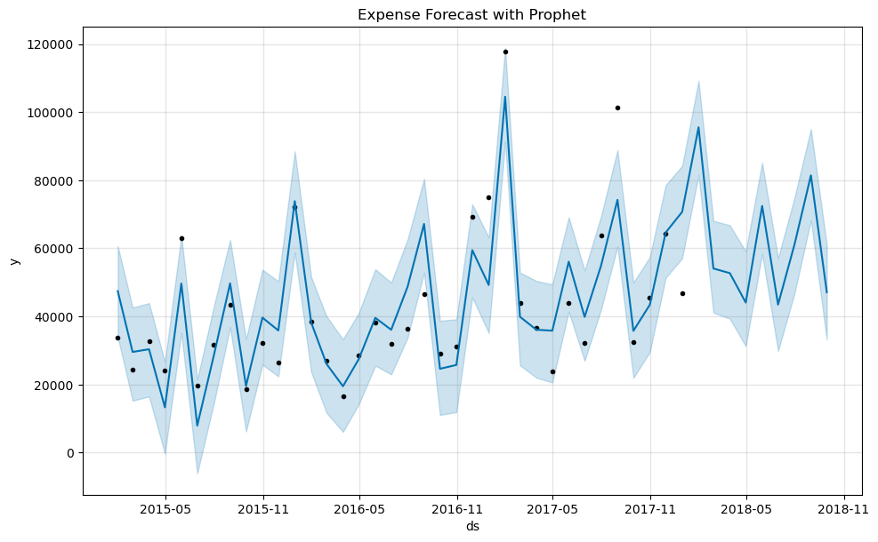

# 💸 Daily Transactions Analysis & Forecasting

A personal project analyzing household transactions to uncover spending patterns, savings trends, and forecast future expenses using Python.

## 🔍 Key Insights
* ₹30+ Lakhs total income | ₹19+ Lakhs total expenses | ₹10.8 Lakhs saved
* Achieved a 35.7% savings rate
* Built time series forecasts with Prophet to estimate future expenses
* Generated actionable recommendations for budgeting and savings

## 🖼️ Visual Insights

### 1. Monthly Income Vs Expenses


``` bash
1. Income generally stayed above expenses, ensuring positive savings.
2. Noticeable income spikes around mid-2017 and early-2018.
3. Expenses peaked in early-2017 and early-2018, but stayed below income.
4. Overall trend shows stable income growth with controlled expenses.
```
### 2. Top 10 Expense Categories


``` bash
1. Money transfers dominate: ~₹6 lakh (largest share).
2. Investments rank second: ~₹2.7 lakh, showing strong savings/wealth focus.
3. Mid-level spends: transportation & household (~₹1.7 lakh each).
4. Subscriptions, food, PPF in the ₹1–1.2 lakh range.
5. Lower spends in other, family, health categories (<₹1 lakh).
```
### 3. Expense Forecast

``` bash
1. Clear Upward Trend: The dark blue forecast line shows a steady increase in expenses over time. This suggests a gradual rise
in your spending habits, which could be due to lifestyle upgrades, inflation, or recurring commitments.

2. Strong Historical Fit: The black dots (actual data points) closely follow the forecast line, indicating that the Prophet model
 has captured your expense behavior accurately. This gives confidence in its future predictions.

3. Forecast Confidence: The light blue shaded region around the forecast line represents the uncertainty interval. While the model
 predicts a general upward trend, it also accounts for variability—especially in months with irregular spending.

4. Seasonality Signals: The pattern hints at periodic spikes and dips, suggesting seasonal or cyclical spending behaviors. These
could be tied to annual events, travel, or festive purchases.

5. Planning Opportunity: With expenses projected to rise, this insight can help you proactively adjust budgets, set savings goals,
or explore cost-cutting strategies before the curve steepens.
```

## 📂 Repository Structure
``` bash
Daily-Transactions-Analysis/
├── README.md
├── data/
│   └── Daily Household Transactions.csv   # Raw transaction data
├── notebooks/
│   └── Daily Transactions.ipynb          # EDA, forecasting, insights
├── visuals/
│   ├── monthly_expenses.xlsx              # Monthly breakdown visuals
│   ├── Excel pivot.xlsx                   # Pivot table summary
│   └── plots/                             # Optional folder for PNG charts
├── report/
│   └── Daily_Transactions.pdf            # Full PDF analysis
├── cleaned_financial_data.xlsx            # Preprocessed dataset
├── expense_forecast.xlsx                  # Forecast outputs
└── requirements.txt                       # Python dependencies
```

## 🛠️ Tech Stack
* Python: Data cleaning & analysis
* Pandas, Seaborn, Matplotlib: Visualization & trend analysis
* Prophet: Expense forecasting
* scikit-learn: Supporting analysis

## 🚀 Getting Started
1. Clone this repo:
``` bash
git clone https://github.com/your-username/Daily-Transactions-Analysis.git
```

Open the notebook:
``` bash
jupyter notebook notebooks/Daily\ Transactions.ipynb
```

## 💬 Feedback & Collaboration

I’d love to hear your thoughts!
* 💡 Suggestions on improving analysis
* 📊 Ideas for better visualizations
* 🤝 Open to collaborations in fintech, analytics, or personal finance
